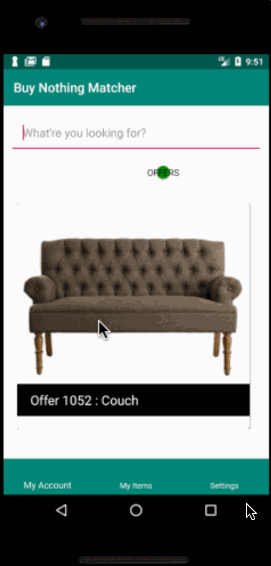

# BuyNothingMatcherApp - Android

This mobile app was inspired by the [Buy Nothing Project](https://buynothingproject.org/) to help facilitate the cycling of resources within a community. The app connects to a Java Springboot API hosted on a Google Cloud Virtual Machine. 


This is a capstone project for [Ada Developers Academy](https://www.adadevelopersacademy.org/) that was completed over the course of 3 weeks. 

[Click here to see my presentation slide deck.](https://docs.google.com/presentation/d/e/2PACX-1vQCf1LbTPrBSkA8FpuZs7ixOmnZhZ8XAKOVetnwFlqUN2YH59MB2ANMpuQdbSA--ct75dJ9h9vmdFTF/pub?start=false&loop=false&delayms=10000&slide=id.g4e62447b99_0_10)


## Demo




## Tech Stack
Backend: [Buy Nothing API](https://github.com/amandaungco/capstoneBuyNothingAPI) built with Java/Spring Boot, Postgres Database, hosted on a Google Cloud Virtual Machine.

FrontEnd: Android Mobile App and Firebase Authentication.


## Features
The main features Buy Nothing Matcher App offers in addition to what users can find on their neighorhood Buy Nothing Facebook Groups: 
1. Users can add item offers or requests to their profiles that will get added to the database. Upon entry, if there is a corresponding match in the DB, the item's profile will be automatically populated with their appropriate matches. Users can view matches and decide if they want to pursue the exchange. 

2. Swiping - On the apps home page, users can toggle between viewing requests and offers. A gesture to swipe right, automatically matches the user with either the offered or requested item, and a swipe left signals disinterest and neither party will be notified. Items advance on their own as assisted by the Swipecards/Glide library.


## Installation

To download and edit this project: 
1. [Download Android Studio](https://developer.android.com/studio/)
2. Clone this repository:
```
git clone https://github.com/amandaungco/BuyNothingMatcherApp.git
```
3. Open Android Studio and select Import Project, then choose the folder into which you cloned this repo.
Connect an Android phone running Android Nougat (APK 23) or higher to your computer. (You can also use an emulator to run the app on a virtual device).

4. Click the green Run button in the menu bar and select the device you plugged in to build the project and install the app on your phone. The app should open automatically.

5. In order to get full functionality the backend API will need to also be cloned and running, please see [Buy Nothing API](https://github.com/amandaungco/capstoneBuyNothingAPI).

## Credits

 * Swipecards base by https://github.com/Diolor/Swipecards
 * Image Assistance by https://github.com/bumptech/glide
